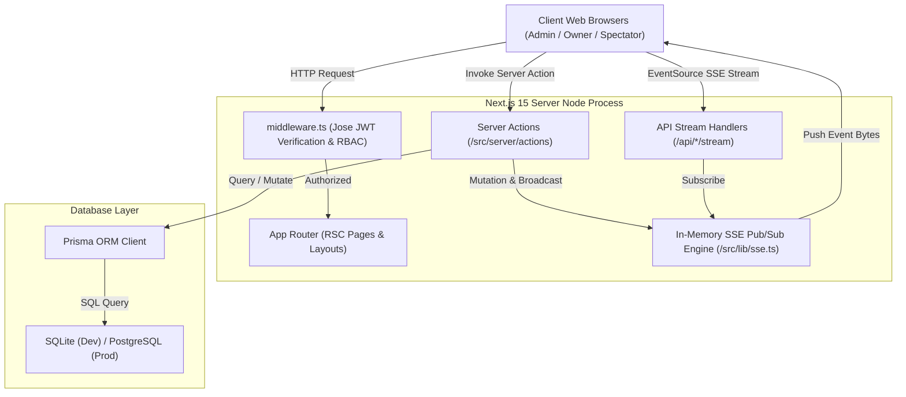
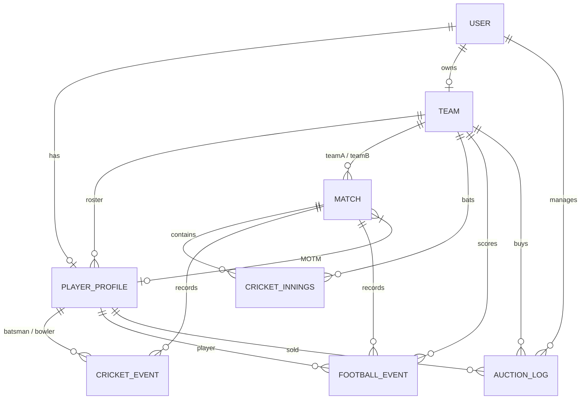
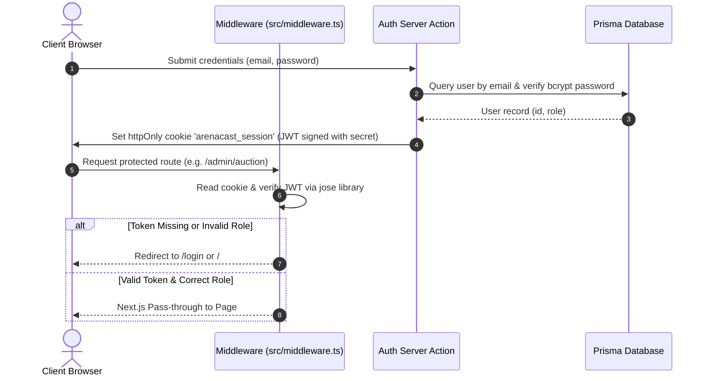

# 📐 ArenaCast — System Architecture & Technical Specifications

This document outlines the software architecture, database data model, real-time event streaming engine, authentication flow, and business logic specs of **ArenaCast**.

---

## 🏛️ High-Level System Architecture

ArenaCast utilizes Next.js 15 App Router, leveraging Server Components for optimized data fetching, Server Actions for mutation workflows, and a custom SSE (Server-Sent Events) engine for real-time scorecards and live auction bidding.



---

## 🗄️ Database Schema & Entity Relationships

ArenaCast uses Prisma ORM with SQLite for local development and direct Postgres migration path. 

### Entity Relationship Diagram (ERD)



### Core Schema Specifications

#### 1. `User`
Stores user identities, hashed credentials, and system roles.
- `id` (String CUID, Primary Key)
- `email` (String, Unique)
- `passwordHash` (String)
- `name` (String)
- `role` (String: `ADMIN` | `PLAYER` | `TEAM_OWNER` | `VIEWER`)

#### 2. `PlayerProfile`
Contains player physical data, sport-specific attributes, registration status, base price, and team association.
- `id` (String CUID, Primary Key)
- `userId` (String, Unique FK -> User)
- `sport` (String: `CRICKET` | `FOOTBALL`)
- `status` (String: `DRAFT` | `SUBMITTED` | `APPROVED` | `REJECTED` | `ON_AUCTION` | `SOLD` | `UNSOLD`)
- `basePrice` (BigInt)
- `soldPrice` (BigInt)
- `teamId` (String FK -> Team)
- `cricketRole` (`BAT` | `BOWL` | `AR` | `WK`)
- `footballPosition` (`GK` | `DEF` | `MID` | `FWD`)

#### 3. `Team`
Represents tournament franchises owned by team owner users.
- `id` (String CUID, Primary Key)
- `name` (String, Unique)
- `sport` (String: `CRICKET` | `FOOTBALL`)
- `ownerId` (String, Unique FK -> User)
- `budget` (BigInt, Default: 1,000,000)
- `spent` (BigInt, Default: 0)

#### 4. `Match`
Defines fixtures between Team A and Team B.
- `id` (String CUID, Primary Key)
- `sport` (`CRICKET` | `FOOTBALL`)
- `teamAId`, `teamBId` (FKs -> Team)
- `scheduledAt` (DateTime)
- `status` (`UPCOMING` | `LIVE` | `FINISHED` | `CANCELLED`)
- `winnerId` (FK -> Team)
- `motmId` (FK -> PlayerProfile)

#### 5. `CricketInnings` & `CricketEvent`
Tracks ball-by-ball events in cricket matches.
- `CricketInnings`: `runs`, `wickets`, `ballsBowled`, `extras`, `order` (1 or 2).
- `CricketEvent`: `over`, `ball`, `batsmanId`, `bowlerId`, `runs`, `isWicket`, `wicketType`, `extraType`.

#### 6. `FootballEvent`
Minute-stamped timeline of football matches.
- `FootballEvent`: `minute`, `teamId`, `playerId`, `type` (`GOAL` | `OWN_GOAL` | `YELLOW` | `RED` | `SUB_IN` | `SUB_OUT` | `PENALTY` | `MISSED_PEN`).

#### 7. `AuctionLog`
Audit log tracking player sales during live auctions.
- `id`, `playerId`, `teamId`, `soldPrice`, `soldAt`, `adminId`.

---

## 📡 Real-time SSE Engine Architecture

ArenaCast features a lightweight, zero-infra real-time pub/sub engine built directly into the Next.js runtime (`src/lib/sse.ts`).

### Pub/Sub Channel Architecture

```
channels Map: Topic String -> Set<ReadableStreamDefaultController>
  ├── "auction" -> [ Controller1, Controller2, ... ]
  ├── "match:cmr3df..." -> [ ControllerA, ControllerB, ... ]
  └── "match:cmr9kz..." -> [ ControllerX, ControllerY, ... ]
```

### Event Streaming Flow
1. **Subscription**: Client initiates `new EventSource('/api/auction/stream')`.
2. **Controller Registration**: The API route handler adds the stream's `controller` to `channels.get('auction')`.
3. **Heartbeat Loop**: An active 25-second interval pushes `: ping\n\n` comments to prevent browser timeout/proxy disconnection.
4. **Publishing**: Admin actions call `publish('auction', payload)`. The SSE engine serializes the payload to `event: message\ndata: ...\n\n` and enqueues bytes to all controllers in the topic set.
5. **Auto-Cleanup**: Disconnected streams automatically delete their controller from the channel `Set` on exception or stream cancel.

### Scaling to Multi-Instance Production
For horizontal scaling across multiple web server instances:
- Replace the `src/lib/sse.ts` in-process `Map` with **Redis Pub/Sub** or **PostgreSQL LISTEN / NOTIFY**.

---

## 🔐 Authentication & Middleware Authorization Flow

ArenaCast uses stateless JSON Web Tokens (JWT) stored in secure, `httpOnly` cookies (`arenacast_session`).



---

## 🧮 Core Business Logic & Algorithms

### 1. Per-Team Budget Cap Enforcement (`src/server/actions/auction.ts`)
During live bidding, when an admin sells a player to a team:
$$\text{Remaining Budget} = \text{Team.budget} - \text{Team.spent}$$
If $\text{soldPrice} > \text{Remaining Budget}$, the transaction is blocked with an error. Upon a successful sale, `Team.spent` is incremented, `PlayerProfile.status` is set to `SOLD`, and an `AuctionLog` audit record is created atomically.

### 2. Standings Algorithm (`src/lib/standings.ts`)
Tournament standings tables are computed dynamically:
- **Cricket**:
  - Points: 2 per Win, 1 per Tie/No Result.
  - Net Run Rate (NRR):
    $$\text{NRR} = \left(\frac{\text{Total Runs Scored}}{\text{Total Overs Faced}}\right) - \left(\frac{\text{Total Runs Conceded}}{\text{Total Overs Bowled}}\right)$$
- **Football**:
  - Points: 3 per Win, 1 per Draw, 0 per Loss.
  - Goal Difference (GD): $\text{Goals For} - \text{Goals Against}$.

---

## 📁 File & Module Directory Structure

```
f:\game build\
├── prisma/
│   ├── schema.prisma         # Database schema & indexes
│   └── seed.ts               # Demo data seeder script
├── src/
│   ├── app/                  # Next.js 15 App Router pages & API handlers
│   │   ├── (admin)/admin/    # Admin portal pages
│   │   ├── (auth)/           # Login & Register routes
│   │   ├── (owner)/my-team/  # Franchise owner cockpit
│   │   ├── (player)/         # Player profile & dashboard
│   │   ├── (public)/         # Public tournament pages
│   │   └── api/              # API route handlers & SSE streams
│   ├── components/           # UI components (auction, match, team, player, ui)
│   ├── lib/                  # Utilities (db, auth, sse, standings, cricket)
│   └── server/actions/       # Server actions (admin, team, auction, score)
└── middleware.ts             # Global RBAC route protection
```
